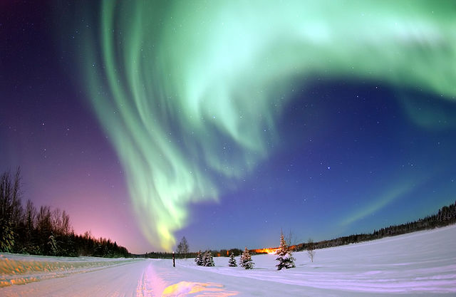

# Morse
Short project inspired by [VSauce](https://www.youtube.com/watch?v=HY_OIwideLg)

## Utils
Contains all the necessary for manipulating morse and encode it in binary format.

### Image
Allows to read the last layer of an image and to analyze if an image has a morse code hidden in it. Each pixel is a time "tic" in a morse code, then '10' is '.', '1110' is '_' and '00' is ' '. For more info, watch the video.  
`hide_in_image` allows to change the last layer in order to force a certain content.

### Palyndrom
Allows to analyze simple palyndrom in English but also in English morse.

## Test
Simple test in order to verify the validity of the functions

## Requirements
Need python3 with numpy, scipy and matplotlib

## Script
###search_palyndrom.py
Downloads a dictionary of English words and analyze which are palyndroms in morse, but also which words are palyndroms in English and in morse.

## Results
### Image
The code in `image.py` allows to hide in `test/PolarLight.jpg` the first paragraph of [Alice's Adventures in Wonderland, by Lewis Carroll](https://www.gutenberg.org/files/11/11-h/11-h.htm). The produced image is:  

### Palyndrom
Executing `python3 search_palyndrom.py` gives **2029** palyndroms:
'2D', '4H', '4th', 'A/P', 'AAE', 'Aar', 'AARC', 'Abate', 'Abelian', 'abime', 'ablute', 'Abp', 'acetate', 'aching', 'acing', 'acitate', 'acme', 'Acuan', 'acuate', 'Adan', 'ADCCP', 'adeep', 'adiate', 'Adnan', 'adnate', 'ADP', 'ADSP', 'ae', 'AEC', 'AEF', 'aer', 'aerometer', 'aesculin', 'Aesir', 'AF', 'Afr', 'afrete', 'after', 'AG', 'Agag', 'Ahir','aye', 'aye-aye', 'AIF', 'aimer', 'Ain', 'AIR', 'airer', 'air-to-air', 'AJC', 'Akan', 'aking', 'Akkerman', 'Alar', 'Alaric', 'Albainn', 'albitic', 'ALC', 'Alec', 'alexinic', 'alexiteric', 'Algar', 'Alic', 'alike', 'allogenic', 'Alric', 'alsike', 'Altaic', 'Alten', 'altern', 'Alur', 'Ambon', 'AME', 'Ammon', 'amnion', 'amniote', 'Amon', 'an', 'anan', 'anding', 'Anette', 'ANG', 'Angang', 'anime', 'anisate', 'anisette', 'anlaute', 'annexing', 'ansate', 'Anshan', 'anteing', 'anticking', 'antiking', 'anting', 'anting-anting', 'antiquating', 'antistate', 'aphasiac', 'ar', 'arar', 'arbtrn', 'ARC', 'arear', 'areic', 'arenilitic', 'arhar', 'Aric', 'aristae', 'arn', 'aroar', 'artar', 'Arte', 'ascite', 'asculae', 'Aser', 'ashen', 'Asher', 'Ashien', 'ashier', 'Ashir', 'Asir', 'ASN', 'ASR', 'Assen', 'Asser', 'Assn', 'ASSR', 'assuasive', 'asteer', 'asterin', 'asterite', 'astir', 'astrer', 'asweve', 'ataman', 'atap', 'ate', 'atip', 'ATN', 'Aton', 'ATP', 'attame', 'atte', 'attn', 'Audwin', 'Auer', 'auf', 'augen', 'aurae', 'Auster', 'Austin', 'Ave', 'avener', 'avenin', 'avenue', 'averin', 'averrer', 'Avner', 'avoir', 'awake', 'awoke', 'axoneme', 'BA', 'Baba', 'back-', 'bae-', 'Baeria', 'baht', 'balu', 'banaba', 'Bangia', 'bania', 'bar-', 'barba', 'barbet', 'baria', 'baruria', 'basi-','BDA', 'be-', 'BEA', 'becurst', 'beefiest', 'beest', 'beet', 'befist', 'behest', 'beisa', 'Belia', 'Bemba', 'Benia', 'Bertha', 'besa', 'beset', 'BeShT', 'besit', 'BEST', 'bet', 'BeV','BHA', 'Bhabha', 'Bhikshu', 'BHT', 'Bia', 'biggest', 'bight', 'birsit', 'biset', 'Bisset', 'bist', 'BIT', 'BIU', 'blea', 'BLit', 'bloodtest', 'Bloomeria', 'bluest', 'BMV', 'BNU', 'boost', 'bottommost', 'boza', 'breba', 'Bria', 'Brusa', 'BSA', 'BSHA', 'BSIT', 'BSSA', 'BST', 'BT', 'BU', 'bught', 'buist', 'burkha', 'Bursa', 'Butsu', 'BV', 'CAA', 'cahuita', 'calescent', 'calk', 'catmint', 'CCT', 'CCTA', 'cd.', 'CEERT', 'ceint', 'cent', 'CERT', 'cesta', 'Ceta', 'chaa', 'cheek', 'chert', 'chevet', 'chint', 'chirt', 'Chita', 'Christa', 'chuet', 'cigua', 'cista', 'Cita', 'civet', 'ck', 'claik', 'clk', 'coct', 'cohort', 'comment', 'concoct', 'conk', 'contort', 'Cort', 'craft', 'Craik', 'Creta', 'croquet', 'CRT', 'csk', 'CT', 'ct.', 'CTA', 'cts.', 'CUA', 'curua', 'cusk', 'CVA', 'D/A', 'DA', 'Dada', 'Daedala', 'Dafla', 'Damia', 'damnit', 'Danit', 'Danu', 'Darda', 'DARU', 'DAV', 'Davilla', 'Daza', 'DCA', 'DCNA', 'DDT', 'DDX', 'DEA', 'debt', 'deda', 'deepest', 'deet', 'DeForest', 'degratia', 'degu', 'deia', 'deist', 'Delesseria', 'deliliria', 'deliria', 'delit', 'denda', 'derv', 'Desha', 'desist', 'dessa', 'destinist', 'DET', 'detenu', 'Deutzia', 'Dev', 'DGA', 'dha', 'Dhu', 'di-', 'DIA', 'Dyanna', 'diatomist', 'Diba', 'Diet', 'dietetist', 'dietist', 'Dieu', 'dimmest', 'direst', 'DISA', 'dishiest', 'dist', 'dit', 'DIU', 'DIV', 'DLA', 'DMDT', 'DMU', 'DNA', 'DNX', 'Dodona', 'doit', 'Dona', 'Donet', 'Dou', 'Dravida', 'Dreda', 'Dreeda', 'Drida', 'Drolet', 'Dru', 'Druella', 'Drusilla', 'DSA', 'DST', 'DSU', 'DT', 'DTU', 'DU', 'Dulcia', 'dumba', 'dunst', 'duo-', 'Durst', 'Dusa', 'DV', 'DX', 'E', 'ead', 'Eal', 'earful', 'EASD', 'eased', 'easel', 'eassel', 'Eben', 'EbN', 'Ebner', 'ebonite', 'Ebsen', 'EC', 'ECC', 'ecesic', 'echar', 'ECN', 'ECSC', 'Eden', 'edenite', 'EDF', 'EDIF', 'Edin', 'Edomite', 'ee', 'EEE', 'EEI', 'Eeyore', 'EFI', 'efts', 'EG', 'Egan', 'egg', 'eglomerate', 'EGP', 'eh', 'EI', 'EIB', 'eide', 'eyen', 'eyr', 'EIS', 'EISS', 'EITS', 'eke', 'el', 'eld', 'Eldred', 'electrine', 'elegized', 'Elene', 'Eleusine', 'Ell', 'Ellene', 'elne', 'eloine', 'Elsene', 'eme', 'emeute', 'emicate', 'emigate', 'emote', 'EMP', 'en', 'Enarete', 'enc', 'Encke', 'endear', 'endobiotic', 'endomitotic', 'enfeoff', 'enfin', 'Enif', 'enjoin', 'enleaf', 'enlister', 'enruin', 'ensete', 'enstatolite', 'ensue', 'entente', 'entete', 'entr', 'Entriken', 'envier', 'EOE', 'eon', 'eponge', 'equate', 'Erce', 'ERD', 'ERE', 'Eriline', 'Erine', 'ERL', 'Erne', 'Ernul', 'erred', 'es', "e's", 'escars', 'eschars', 'ESDI', 'ese', 'eses', 'ESH', 'ESI', 'ESIS', 'eskars', 'Eslie', 'ess', 'esse', 'essee', 'esses', 'Essie', 'Esteli', 'esterase', 'esters', 'Estes', 'Esth', 'esthetes', 'etching', 'eten', 'ETF', 'Ethben', 'ether', 'ethylin', 'ETN', 'Etnean', 'Eton', 'ETR', 'ette', 'ettling', 'Evars', 'evase', 'evens', 'Everrs', 'Evers', 'eves', 'evites', 'exalte', 'exameter', 'Exeter', 'exister', 'exite', 'exogen', 'exter', 'ezan', 'fadged', 'FAI', 'faired', 'famine', 'fanged', 'fanweed', 'farced', 'fared', 'Farl', 'Fatimid', 'favel', 'FD', 'FE', 'feazed', 'FED', 'feed', 'feeded', 'feel', 'feere', 'feezed', 'Feil', 'fell', 'felled', 'Femmine', 'fenced', 'fere', 'ferfel', 'ferine', 'fermail', 'Ferrel', 'Fertil', 'fessed', 'fetid', 'FGD', 'fibrefill', 'fibrine', 'fictil', 'fid', 'fidded', 'fied', 'fiel', 'Fife', 'fil', 'finagled', 'FINE', 'fyrd', 'fire', 'firebed', 'fished', 'fizzed', 'FL', 'Flamsteed', 'flavid', 'flavine', 'fld', 'fleered', 'fluid', 'foamed', 'foeti', 'fol', 'fond', 'fool', 'footed', 'footstool', 'fore', 'fraid', 'FRED', 'freshened', 'Frl', 'FTL', 'fueled', 'Fugere', 'fulicine', 'full', 'full-to-full', 'fumagine', 'fungid', 'furfurine', 'Furnivall', 'fustee', 'futzed', 'fuzed', 'gaitt', 'gamut', 'Garett', 'Garnett', 'Gat', 'Gaut', 'GCM', 'Geat', 'Gelett', 'GEM', 'gerim', 'ghat', 'Gy', 'gilim', 'gim', 'gyny', 'Gitt', 'GM', 'Gmat', 'GMW', 'gnaw', 'gneissy', 'Goat', 'goaty', 'goy', 'gouty', 'Gow', 'grat', 'grenat', 'GSAT', 'GTT', 'guillem', 'Gut', 'GW', 'H', 'haeres', 'hails', 'Haines', 'hairballs', 'hairse', 'Haysi', 'halch', 'Halie', 'Hals', 'hambones', 'Hanse', 'harbi', 'Hardie', 'hards', 'hares', "hare's", 'hartals', 'Harwich', 'hassels', 'haverels', 'HE', 'hearties', 'heavies', 'hech', 'hectares', 'Heddie', 'Hedie', 'Hedveh', 'hee', 'hee-hee', 'hee-hee!', 'heezes', 'heh', 'Hehe', 'he-he!', 'hehs', 'hei', 'heii', 'heinies', 'heiress', 'Heis', 'Heise', 'heishi', 'Helles', 'Helse', 'hemiepes', 'Hench', 'hennes', 'Henoch', 'hepatise', 'hepatizes', 'Herbie', 'herbs', "herb's", 'heredes', 'hes', "he's", 'Hess', 'Hesse', 'hexis', 'HH', 'HI', 'Hibbs', 'hickies', 'hides', 'hie', 'hies', 'HIH', 'hyli', 'Hillis', 'hymens', 'hippies', 'Hyrie', 'HIS', 'hish', 'hisis', 'Hiss', 'hisses', 'hiveless', 'HNS', 'hoagie', 'Hoes', "hoe's", 'hogs', "hog's", 'homes', 'Hons', 'hoose', 'Hose', 'hotdogs', 'HRH', 'HS', "h's", 'HSH', 'HSI', 'Hubie', 'hubs', "hub's", 'Hunanese', 'hurtles', 'Huss', 'i', "i'", '-i-', 'YA', 'IAB', 'Yahiya', 'Yaya', 'yak', 'yak-yak', 'iamb', 'Iams', 'IAS', 'Iasus', 'ibid', 'ical', 'ICD', 'ice', 'id', "I'd", 'IDDD', 'Idel', 'IDL', 'idled', 'ie', 'IEE', 'IEEE', 'Yesima', 'yet', 'Yetta', 'yeuk', "i'faith", 'IFS', 'igad', 'ihi', 'IHS', 'ii', 'IIE', 'iii', 'Iyre', 'ile', 'ileus', 'Ilheus', 'Ilioneus', 'Ilissus', 'Yma', 'IMD', 'imi', 'immi', 'Imtiaz', 'IMunE', 'incalescence', 'incentre','incidence', 'incipience', 'incocted', 'inconcocted', 'IND', 'indebted', 'indentee', 'indice', 'indicial', 'Indienne', 'indited', 'indued', 'indure', 'ine', 'infeed', 'infeminine', 'infill', 'ingenerated', 'inhere', 'Inine', 'initialled', 'inked', 'INL', 'inlaid', 'inmore', 'inne', 'innyard', 'insensed', 'inswathed', 'inteind', 'intend', 'intented', 'intercentral','interdiscal', 'intergyral', 'internal', 'interne', 'interneural', 'interpreted', 'interrenal', 'interstice', 'inti', 'intice', 'Intyre', 'intl', 'intoed', 'intransigence', 'intravital', 'intrince', 'intuited', 'invalid', 'invaried', 'inveil', 'inweed', 'IOD', 'yok', 'Ione', 'ionone', 'yont', 'yook', 'IPI', 'IPMS', 'IRAS', 'Iri', 'irks', 'Irus', 'is', "i's", 'ISCH', 'ise', 'ISEE', 'ish', 'Ishii', 'ISI', 'ISIS', 'isles', "isle's", 'isotones', 'ISS', 'Issei', 'isseis', 'ISSI', 'Issie', 'itai', 'Ital', 'ITCZ', 'itd', "it'd", 'itel', 'itemed', 'Ithiel', 'ithomiid', 'Itnez', 'Yuk', 'yuk-yuk', 'Yulma', 'Yumuk', 'Yurak', 'Ivis', 'IWS', 'Iz', 'JAG', 'Jayn', 'jawn', 'Je', 'jg', 'Joe', 'jog', 'jog-jog', 'jomon', 'Jon', 'Joon', 'jug', 'jug-jug', 'K', 'K.', 'K.K.K.', 'Ka', 'Kabaka', 'kafta', 'kaka', 'Kalmick', 'Kanaka', 'kanuka', 'kart', 'Kaska', 'katuka', 'keck', 'keek', 'Keita', 'kelk', 'Kendrick', 'Kent', 'Kenta', 'Kerek', 'Ket', 'keta', 'KFT', 'Khiva', 'kyak', 'Kieta', 'Kirt', 'kiva', 'KKK', 'kl.', 'Klarika', 'Klenk', 'kmet', 'Knt', 'Koa', 'Kolyma', 'komtok', 'kook', 'Kota', 'Kotta', 'kr.', 'Krock', 'Kua', 'kVA', 'Laden', 'Lae', 'Lafite', 'Lager', 'lainer', 'lair', 'lamden', 'lamiae', 'Langer', 'langite', 'langue', 'larcin', 'larin', 'Larner', 'LaRue', 'Laufer', 'lave', 'laveer', 'LCDN', 'LCR', 'leader', 'leadin', 'leavier', 'leden', 'Lederer', 'lederite', 'Ledidae', 'leef', 'leer', 'leerier', 'Leesen', 'leeser', 'lefsen', 'Leger', 'legger', 'leggin', 'Lehr', 'Leif', 'Leiser', 'Leler', 'Lemper', 'Len', 'Lenin', 'Leninite', 'leonite', 'Ler', 'Leschen', 'lessen', 'Lesser', 'lessive', 'lessn', 'leste', 'lete', 'leve', 'lewder', 'LF', 'libeler', 'libr', 'lidder', 'Lief', 'liegier', 'lien', 'lier', 'lieue', 'lieve', 'Lif', 'Lihue', 'liin', 'limier', 'Lin', 'Linder', 'linkier', 'linolin', 'lintier', 'lippier', 'Lir', 'Lyrae', 'lysimeter', 'lite', 'live', 'LMF', 'ln', 'lnr', 'LOF', 'loin', 'loof', 'loomer', 'looter', 'lotter', 'LPF', 'LR', 'LSR', 'LTF', 'Luben', 'lue', 'lustier', 'Lutsen', 'LXE', 'm', "M'", "'m", 'Maat', 'MacKay', 'Maely', 'mafey', 'May', 'Maidy', 'maidly', 'mainly', 'Maisey', 'makeshifty', 'Maleeny', 'mammy', 'mammotomy', 'mamoty', 'Manity', 'manky', 'manty', 'mappy', 'Marbury', 'Marcy', 'Mary', 'marm', 'marry', 'martyry', 'mashy', 'Massey', 'massy', 'Mastat', 'Mat', 'maty', 'Matty', 'Maudy', 'Maurey', 'maw', 'Maxy', 'MBO', 'meat', 'medley', 'Meerut', 'mem', 'meny', 'mentary', 'mentery', 'meow', 'Merat', 'mercat', 'mesem', 'metallary', 'metely', 'metonymy', 'metry', 'metrify', 'Metty', 'mew', 'MHW', 'miasm', 'Miett', 'MIM', 'miseat', 'misseat', 'mis-seat', 'misseem', 'mis-seem', 'mitt', 'mixt', 'MM', 'MMM', 'mmmm', 'MMT', 'Mnium', 'mo', 'mom', 'momo', 'Monjo', 'moo', 'moot', 'mormo', 'MOT', 'motmot', 'Mott', 'motto', 'MRSRM', 'MSEM', 'MSM', 'MSW', 'MT', 'MTM', 'MTO', 'MTSO', 'mulm', 'Murat', 'mut', 'MW', 'NA', 'Naara', 'Naga', 'naira', 'Nammu', 'Nana', 'nanga', 'nanmu', 'Nara', 'narica','Nashira', 'Nassau', 'natu', 'NAU', 'NEA', 'Neala', 'Nedra', 'neet', 'Neillia', 'Neisa', 'neist', 'Nela', 'Nelda', 'Nella', 'Nemea', 'Nena', 'Neoga', 'Neona', 'nepit', 'Nesbit', 'Nessa', 'nest', 'NET', 'Neu', 'neur-', 'Nev', 'NFU', 'NHA', 'NIA', 'Nida', 'niyanda', 'Nikola', 'Nisa', 'Nissa', 'NIST', 'nit', 'Nitza', 'NIU', 'Niv', 'noa', 'Noma', 'nook', 'nota', 'Nouma', 'NPA', 'NQ', 'NRA', 'NSA', 'NST', 'NSU', 'NT', 'NU', 'Nuda', 'numda', 'Nunu', 'NV', 'o', "O'", '-o-', 'O2', 'oam', 'Ocko', 'Oeno', 'OEO', 'Ohio', 'oho', 'Oketo', 'OM', 'OMM', 'Omoo', 'onym', 'onto', 'OO', 'o-o', 'oooo', 'OOT', 'Oronoco', 'Orsino', 'OS2', 'OSO', 'Osseo', 'ot', 'OTM', 'Oto', 'Ott', 'ottetto', 'Otto', 'outdo', 'outswum', 'ouzo', 'Owego', 'owt', 'oxo', 'Ozmo', 'P', 'paean', 'pagan', 'PAN', 'Pangwe', 'Paran', 'parate', 'Parette', 'pastime', 'Pate', 'pean', 'pecan', 'peep', 'Peg', 'Pellan', 'pellate', 'pennate', 'PEP', 'Perean', 'Perun', 'Peruvian', 'PETN', 'PG', 'phaseun', 'Phip', 'pian', 'pidan', 'pye', 'pig', 'pileate', 'pinnatulate', 'pinnulate', 'PIP', 'pip-pip', 'Pisan', 'Piute', 'PMEG', 'pomate', 'pomp', 'pong', 'Poop', 'POP', 'porkman', 'portman', 'Postman', 'potate', 'potman', 'potong', 'Powe', 'PP', 'PPP', 'prate', 'Praxean', 'predestinate', 'predestitute', 'preominate', 'prorate', 'protectorate', 'prp', 'PSG', 'psig', 'PSP', 'PSTN', 'PTN', 'PTP', 'pulp', 'pun', 'PVN', 'qat', 'Qy', 'QKt', 'QSY', 'qt', 'QTY', 'quandy', 'quat', 'queenly', 'quem', 'quilly', 'quirkily', 'quitely', 'R', 'RAAF', 'Rae', 'RAF', 'Ragen', 'rain', 'Ramer', 'Ramin', 'rammer', 'Raphaelesque', 'rapter', 'raster', 'rateen', 'rater', 'ratite', 'ratteen', 'ratter', 'raver', 'ravin', 'RBC', 'RBHC', 'RC', 'RCC', 'RCN', 'RDC', 'reagin', 'rearer', 'Reave', 'recenter', 'reeden', 'Reef', 'reefier', 'Reeher', 'reeler', 'reen', 'Reeve', 'ref', 'reflexiue', 'Regen', 'reggae', 'regr', 'regrater', 'regretter', 'rehete', 'Reider', 'reif', 'Rein', 'reindue', 'Reiser', 'reissue', 'reive', 'reliefer', 'reliner', 'Remer', 'remitter', 'Remmer', 'remoter','remue', 'REN', 'Renae', 'renter', 'repin', 'repledger', 'researcher', 'reseen', 'reseiser', 'resin', 'resite', 'Reste', 'restive', 'resue', 'retain', 'retaker', 'rete', 'retin', 'retinae', 'retter', 'Reuben', 'reve', 'revive', 'rewhisper', 'rewove', 'Rexer', 'RF', 'Rheae', 'rheen', 'Rhein', 'ricer', 'ricin', 'ridden', 'riden', 'rier', 'RIF', 'rifleite', 'rigger', 'riggite', 'rin', 'Riner', 'rinner', 'risen', 'riser', 'Risser', 'rite', 'Ritner', 'rive', 'RMC', 'RMR', 'RN', 'RNGC', 'RNVR', 'ROC', 'rocketor', 'roke', 'Romayor', 'Ronn', 'Rooke', 'ROTC', 'rotor', 'rotten', 'RR', 'RSN', 'RSR', 'RTC', 'rte', 'RTR', 'Rudiger', 'Rue', 'Ruff', 'ruiner', 'runer', 'runite', 'Rutger', 'Ruttger', 's', "'s", 'sabe', 'sabzi', 'Sadi', 'sags', 'sah', 'Saidee', 'Saidi', 'saimins', 'sains', 'saith', 'SALI', 'salterns', 'samh', 'Sammons', 'sangei', 'sannups', 'Sans', 'sarsars', 'SASE', 'sasins', 'satangs', 'sates', 'satiates', 'satraps', 'saturates', 'Sauers', 'savarins', 'saves', 'sawah', 'SB', 'SBUS', 'scale', 'SCB', 'scents', 'Schule', 'SCI', 'scotale', 'SCTS', 'SDB', 'SE', 'Seabee', 'sealch', 'seals', 'search', 'seathe', 'secerns', 'secpars', 'Secs', 'seculars', 'seders', 'See', 'seech', 'seeds', 'sees', 'seesee', 'seethe', 'Seferis', 'segs', 'SEI', 'seiche', 'seis', 'seise', 'seises', 'seizes', 'Sekondi', 'Selie', 'sellie', 'Sells', 'sels', 'Semangs', 'sememes', 'semes', 'Semmes', 'sendee', 'senors', 'serais', 'serenes', 'Seres', 'serines', 'SES', 'sess', 'Seth', 'setons', 'setose', 'settlings', 'Seuss', 'sevenths', 'severies', 'sexes', 'SGI', 'sh', 'she', 'shee', 'sheenless', 'sheepish', 'sheetless', 'shelterless', 'shes', "she's", 'shh', 'shi', 'Shieh', 'shies', 'Shih', 'Shii', 'shineless', 'shish', 'shrimpiness', 'sh-sh', 'SI', 'siamoise', 'sicarii', 'sycee', 'Sices', 'sich', 'sickees', 'sidelines', 'sie', 'Sienese', 'sigh', 'Simois', 'sines', 'single-stitch', 'sinh', 'sirees', 'siris', 'sirrees', 'sis', 'sise', 'sises', 'sish', 'sisi', 'siss', 'Sissie', 'sissies', 'sithe', 'skas', 'skirts', 'Skokie', 'skuas', 'skulks', 'slaves', 'slee', 'sleeves', "sleeve's", 'sliders', 'slues', 'smarms', 'SMB', 'smews', 'Smoos', 'SMS', 'Smuts', 'sneb', 'snee', 'Snellville', 'snib', 'sniddle', 'snide', 'snits', 'snooks', 'SOB', 'Somni', 'Soni', 'soogee', 'soots', 'sopranos', 'SOS', 'sotie', 'Sotos', 'sots', 'sottie', 'spans', "span's", 'spates', "spate's", 'spath', 'speans', 'SPS', 'squab', 'squats', 'SRS', 'SS', "s's", 'SSE', 'SSI', 'SSS', 'SSTTSS', 'Stacee', 'Staci', 'stale', 'staree', 'starkle', 'Starks', 'startle', 'starts', 'STB', 'Steele', 'Steffi', 'stele', 'stemmas', 'steri', 'Stets', 'Stevie', 'Sthenius', 'stib', 'stile', 'Stillas', 'stob', 'stomatode', 'stomode', 'stree', 'streeks', 'STS', 'STTOS', 'subcutis', 'subheads', 'suds', 'sugh', 'surds', 'sures', 'Susi', 'suspires', 'suttees', 'Suzie', 'swaggie', 'swamps', 'swans', "swan's", 'Swaps', 'swath', 'sweath', 'sweeps', 'swigs', 'swoons', 'swoose', 'SXS', 'T', "t'", "'t", 't.', 'TA', 'taa', 'Tadema', 'taffeta', 'Taft', 'tahua', 'taint', 'Tak', 'Tama', 'Tamaroa', 'Tamma', 'tanak', 'Tanya', 'tapotement', 'tart', 'task', 'ta-ta', 'Tathata','tatta', 'TCM', 'TDM', 'tea', 'tech.', 'teck', 'tecta', 'Teena', 'teenet', 'teest', 'teet', 'teju', 'TELEX', 'tellt', 'telt', 'TEMA', 'temiak', 'tempt', 'tenent', 'Tenn.', 'tent', 'tentwork', 'tepa', 'Tera', 'tercet', 'Terena', 'Teresina', 'Terina', 'terna', 'Terra', 'Terrena', 'terret', 'Tersina', 'tescaria', 'Tessa', 'Test', 'tet', 'teufit', 'tewit', 'TFX', 'th-', 'tha', 'Thalia', 'thanatist', 'Thea', 'Thebit', 'theet', 'Theia', 'theist', 'thematist', 'Theresa', 'Thessa', 'thewiest', 'Thia', 'Thissa', 'ty', 'TIA', 'Tica', 'ticca', 'tienda', 'Tiga', 'Tila', 'Tilda', 'Tilla', 'Tilleda', 'tillet', 'Tilletia', 'TINA', 'Tineina', 'tinnet', 'Tioga', 'Tiona', 'Tiou', 'tipit', 'tirrit', 'Tisa', 'Tisha', 'tissu', 'Tit', 'Tyty', 'Tiu', 'Tiv', 'tkt', 'TM', 'TMO', 'TO', 'toyo', 'Tokyo', 'Tom', 'tom-tom', 'too', 'toom', 'toot', 'tootmoot', 'too-too', 'topknot', 'torot', 'Torto', 'tot', 'toto', 'TPT', 'traik', 'transigent', 'trek', 'Trent', 'Treva', 'trevet', 'Tryck', 'trident', 'Trient', 'Trista', 'trivet', 'tronk', 'trt', 'tsamba', 'tsia', 'TSST', 'TST', 'TT', 'TU', 'tufa', 'tuna', 'Tunga', 'Tura', 'Turku', 'tutu', 'tux', 'TV', 'TWA', 'twant', 'tweak', 'txt', 'Ud', 'UEL', 'UI', 'UID', 'UIL', 'UL', 'Uleki', 'ulnare', 'ultranatural', 'umbone', 'uncharge', 'UNCTAD', 'Une', 'unedge', 'unhad', 'unhead', 'unmad', 'unsad', 'unsane', 'unsiege', 'up-and', 'uphand', 'upsetted', 'upwound', 'Ural', 'urare', 'Urd', 'ure', 'ureal', 'ureteral', 'urethral', 'Urial', 'Ursal', 'USD', 'used', 'usine', 'USL', 'uti', 'Vaas', 'VAFB', 'Vale', 'Vanni', 'vari', 'varkas', 'Vas', 'Vasari', 'VB', 'VDE', 'veenas', 'vei', 'veinlets', 'veldts', 'vents', 'venule', 'veri', 'Vermetus', 'vernicle', 'Verras', 'vertus', 'vessets', 'vestible', 'Vestie', 'vests', 'vets', 'VGI', 'vias', 'victus', 'vide', 'vie', 'viewable', 'vigas', 'viggle', 'Vilas', 'VILE', 'Villas', "villa's", 'ville', 'vinas', 'vincas', 'virus', 'visas', 'visile', 'visits', 'Vitus', 'Vivie', 'VMOS', 'VMS', 'VRI', 'VS', "v's", 'VSB', 'VTS', 'waeg', 'wafting', 'Wayan', 'wayang', 'wairing', 'waiting', 'Wakeman', 'wamp', 'WAN', 'Wang', 'WAP', 'washing', 'washup', 'wattman', 'waup', 'wavering', 'we', 'wean', 'webeye', 'wedeling', 'weep', 'Weig', 'WG', 'whan', 'wheep', 'Whig', 'whip', 'whisp', 'whun', 'whute', 'Wig', 'Wigan', 'Willette', 'wime', 'Wyn', 'wintertime', 'Wintun', 'WIP', 'wisp', 'wyte', 'Witte', 'woe', 'woesome', 'wog', 'Won', 'woon', 'Wooton', 'Worton', 'wosome', 'wote', 'Wotton', 'WP', 'wrap', 'wrecking', 'wring', 'writeup', 'Wsan', 'WSP', 'Wun', 'X', 'Xena', 'Xina', 'xix', 'xoanona', 'xu', 'xx', 'xxx', 'Zagut', 'zat', 'zeism', 'Zim'.  

And the **107** English and morse palyndroms are : 'E', 'ee', 'EEE', 'eke', 'eme', 'EOE', 'ERE', 'ese', 'esse', 'ette', 'H', 'heh', 'HH', 'HIH', 'HRH', 'HSH', 'i', '-i-', 'ihi', 'ii', 'iii', 'imi', 'immi', 'IPI', 'ISI', 'ISSI', 'K', 'keek', 'KKK', 'kook', 'm', 'mem', 'mesem', 'MIM', 'MM', 'MMM', 'mmmm', 'mom', 'MRSRM', 'MSM', 'MTM', 'o', '-o-', 'OEO', 'oho', 'OO', 'o-o', 'oooo', 'OSO', 'ottetto', 'oxo', 'P', 'peep', 'PEP', 'PIP', 'pip-pip', 'POP', 'PP', 'PPP', 'prp', 'PSP', 'PTP', 'R', 'retter', 'RMR', 'rotor', 'RR', 'RSR', 'RTR', 's', 'sees', 'sememes', 'semes', 'SES', 'sexes', 'siris', 'sis', 'SMS', 'SOS', 'SPS', 'SRS', 'SS', "s's", 'SSS', 'SSTTSS', 'STS', 'SXS', 'T', 'teet', 'terret', 'tet', 'tipit', 'tirrit', 'tkt', 'toot', 'torot', 'tot', 'TPT', 'trt', 'TSST', 'TST', 'TT', 'txt', 'X', 'xix', 'xx', 'xxx'
